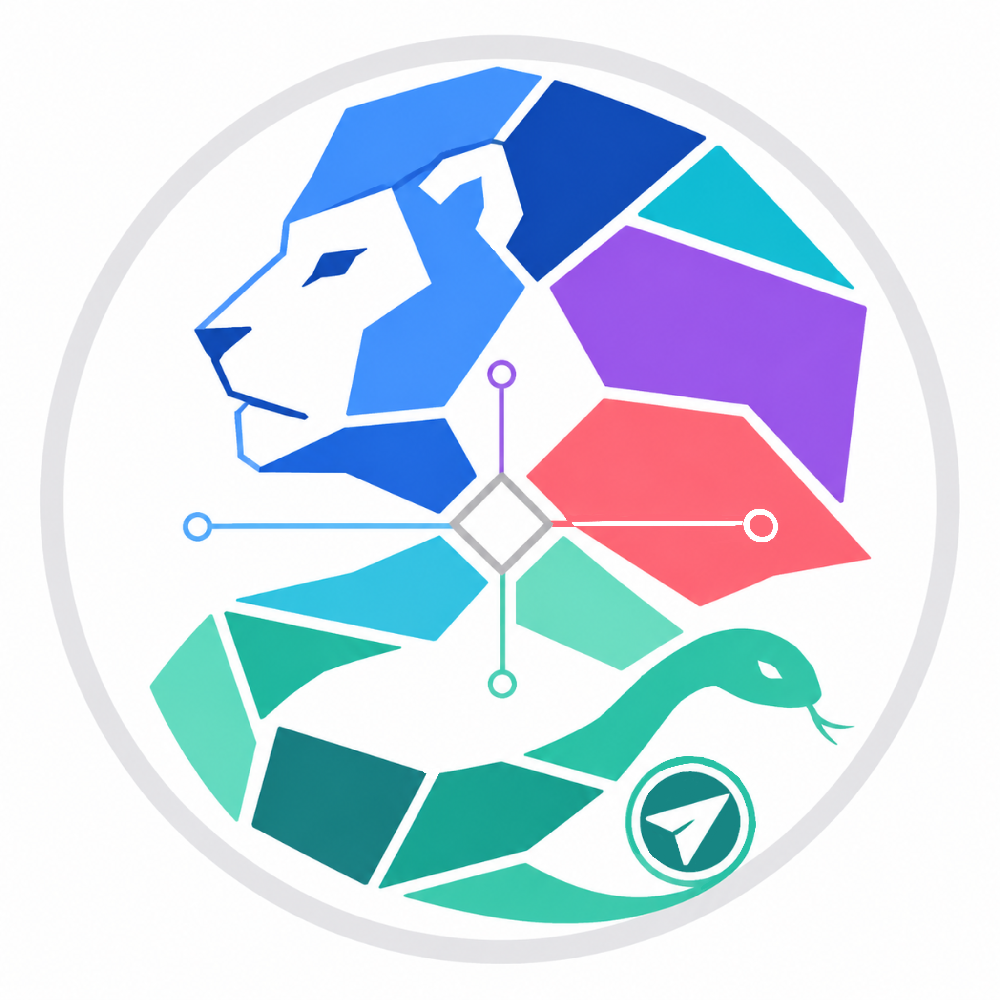

<p align="center">
  
</p>

# Chimera

[English](README.md) | [简体中文](README.zh.md)

Chimera is an AI coding agent distribution: an opencode-derived interactive CLI plus the built-in Chimera/CodeGraph graph and propagation-audit runtime.

The public package and command name is `chimera`. Graph/runtime commands are part of the same CLI; there are no public `opencode` or `codegraph` bins for this distribution.

## Package identity

- Complete agent package source: [`packages/chimera`](packages/chimera)
- npm package name: `chimera`
- public CLI command: `chimera`
- graph command entry points: `chimera graph ...` and `chimera --graph ...`

When this repository refers to the original project, it uses **upstream opencode** or **original opencode** explicitly.

## Design lineage and references

The name Chimera is intentional: this project combines strengths from several agent and graph-runtime systems into one distribution, while keeping the public package and command identity as `chimera`.

Chimera acknowledges these design references:

- [upstream opencode][upstream-opencode] provides the interactive coding-agent foundation and CLI runtime lineage.
- [Kimi Code][kimi-code] informs Kimi-focused behavior, including provider-specific prompt, tool, search, and authentication considerations for Kimi models.
- [Codex][codex] informs OpenAI/Codex/GPT-oriented behavior, including context discipline and direct Responses/OAuth integration patterns.
- [CodeGraph][codegraph] provides the repository graph and semantic-evidence substrate behind Chimera's impact analysis and propagation-audit direction.
- [OpenCodeUI][opencode-ui] provides the web-based user interface (`packages/newweb`), which is licensed under GPL-3.0.

These references describe architectural lineage and implementation influences. Chimera is not presented as upstream opencode, Kimi Code, Codex, or CodeGraph; it is the combined Chimera distribution built on and inspired by those systems.

## Install and run

Chimera is not yet published to the npm registry. Download the latest release
tarballs from [GitHub Releases](https://github.com/coding-chimera/chimera/releases)
and install with npm.

Choose `no-webui` (MIT) or `with-webui` (GPL-3.0-only aggregate, with the MIT runtime license included separately). Both variants install the same `chimera` and `chimera-<platform>` package identities, so install only one variant at a time.
Check the releases page for the latest version and exact tarball filenames.

```bash
npm install -g ./chimera-darwin-arm64-no-webui-0.0.5-patch1.tgz ./chimera-no-webui-0.0.5-patch1.tgz
chimera --version
```

Inside the CLI, use `/help` for interactive help.

For local development builds, see [Build and package](#build-and-package).

## Graph runtime

Chimera includes project graph indexing, symbol search, impact discovery, and propagation-audit workflows.

Common commands:

```bash
chimera graph status
chimera graph init <project>
chimera graph query <symbol> --path <project>
chimera --graph status
```

Project-local graph data belongs under `.chimera/`. Legacy `.codegraph/` data is compatibility-only; migrate it explicitly with Chimera graph migration commands instead of moving or deleting it manually.

Read-only graph surfaces such as status and query should report the current data-root state without creating graph data.

## Development

This repository uses Bun. Install dependencies from the `chimera/` workspace root:

```bash
bun install
```

Run the agent from the package directory:

```bash
cd packages/chimera
bun run --conditions=browser src/index.ts
```

Typecheck and test from package directories, not from the repository root:

```bash
cd packages/chimera
bun typecheck
bun test --timeout 30000
```

The root `test` script intentionally blocks root-level test runs.

## Build and package

Build the default current-platform no-WebUI package from `packages/chimera`:

```bash
OPENCODE_CHANNEL=latest bun run build --single --skip-install
```

The default package intentionally does not embed the GPL-licensed NewWeb/OpenCodeUI-derived assets. To also produce a clearly separated with-WebUI variant for release assets, run a second build:

```bash
OPENCODE_CHANNEL=latest bun run build --single --skip-install --with-webui --preserve-npm-tarballs
```

Tarballs are written to:

```text
dist/npm-tarballs/
```

No-WebUI tarballs are named like `chimera-no-webui-<version>.tgz`; with-WebUI tarballs use `with-webui` in the same position. The variant is not part of the npm package name.

Standalone no-WebUI CLI archives keep the compatibility names such as `chimera-darwin-arm64.zip`; with-WebUI archives add `-with-webui`. Every standalone archive includes the license files for its variant at the archive root.

A locally packed install can be smoke-tested with a temporary npm prefix. Install the matching main and platform tarballs for exactly one variant at a time:

```bash
prefix="$(mktemp -d)"
npm install -g --prefix "$prefix" dist/npm-tarballs/chimera-darwin-arm64-no-webui-*.tgz dist/npm-tarballs/chimera-no-webui-*.tgz
"$prefix/bin/chimera" --version
"$prefix/bin/chimera" --graph --help
```

## Repository layout

- `packages/chimera` - complete Chimera agent package and CLI runtime
- `packages/app` - web application
- `packages/console/app` - console UI assets and app
- `packages/desktop` - desktop application
- `packages/sdk/js` - JavaScript SDK package
- `packages/docs` - documentation package

## Contributing

Read [CONTRIBUTING.md](CONTRIBUTING.md) before submitting changes.

When changing agent-facing tools, prompts, graph commands, installer behavior, or package identity, update the corresponding user-facing and agent-facing guidance in the same change.

## License

The no-WebUI main and platform packages are licensed under MIT, include the repository MIT `LICENSE`, and do not contain the NewWeb payload.

The with-WebUI main and platform packages are distributed as `GPL-3.0-only`: `LICENSE` contains GPLv3, `LICENSE-MIT` preserves the Chimera runtime's MIT license, and `NOTICE` describes the component/source boundary. It embeds the GPL-licensed NewWeb/OpenCodeUI-derived payload from `packages/newweb`.

MIT

[upstream-opencode]: https://github.com/anomalyco/opencode
[kimi-code]: https://github.com/MoonshotAI/kimi-code
[codex]: https://github.com/coding-chimera/codex
[codegraph]: https://github.com/colbymchenry/codegraph
[opencode-ui]: https://github.com/lehhair/OpenCodeUI
